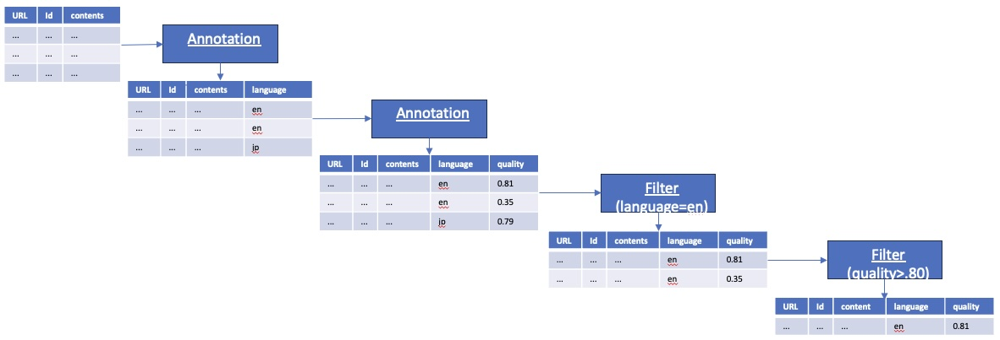

# Data Schema and Processing
The transformation framework is designed to operate on rows of columnar data, generally contained
in [parquet](https://arrow.apache.org/docs/python/parquet.html) files 
and read as [pyarrow tables](https://arrow.apache.org/docs/python/index.html).

Transforms are written to process the [table](https://arrow.apache.org/docs/python/generated/pyarrow.Table.html)
to, for example:

* Remove duplicates or non supported documents, for example, exact and fuzzy dedup, or language selection
* Transform files, for example coalesce or split files or add/remove some of the columns
* Annotate the tables to add additional data such as document quality score, language, etc.
* Derive statistics on data in one or more columns 
* Filter the table to remove or edit rows and/or columns, for example to remove rows from blocked domains.

The table is generally expected to have something like the following minimal set of columns :
* URL source of the document (can be use for domain block listing)
* Document id
* Contents of the actual document to be used for LLM training

The following might be an example sequence of transforms.

The ordering of the transforms can change depending on the requirements on the training data. 

Each transform is generally run on a set of input files to produce a set of output files.
The transforms are generally sequenced/stitched together, 
each accepting the completed set of output files from a
previous transform in the sequence. 

To address scalability, a transform is generally run in a dedicated Ray cluster
deployed into a kubernetes cluster.  

