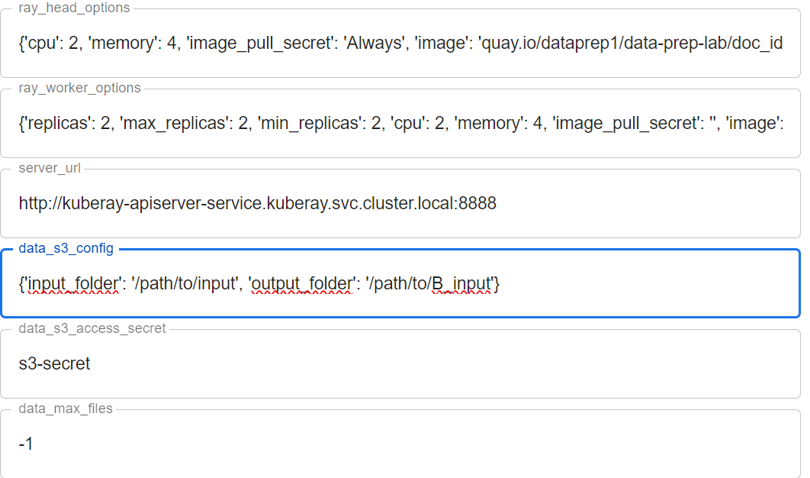

# Run several transforms

In a common scenario, users want to run a pipeline or a series of several transforms one after the other. Here we can show how to execute several transforms.

Let's assume that the input folder path is `path/to/input` and the user want to save the output of the data after several transforms in `path/to/output`. Let's assume also that the user want to apply transform `A` then transform `B` on his data.

In section `Executing pipeline and watching execution results` of the `sinmple_transform_pipeline.md` you can learn how to run a KFP pipeline of one transform.

Let's start with transform A (in this example it is exat deduplication). After uploading the pipeline you can create a run from this page:

After clicking `create run` a list of input parameters is shown in the screen. In this document we want to deal with the `s3_config` input parameter. This parameter specifies the input folder path and outhput folder path. In the transform A we should have `input_folder = path/to/input` and the `output_folder=/path/to/<B>_input` which is an intermediate folder that we will use s an input for the next transform.

After finishing a transform we can continue to the next one. As previous step, after uploading the pipeline of the transform B (in this example it is fuzzy deduplication) we can create a run:

in the list of input parameters we can also find `s3_config` input parameter. In the transform B we should have `input_folder = path/to/B_input` (the same as the output folder of the previous transform) and the `output_folder=/path/to/output` which is the desire output folder for the whole task (this should be only in the last tranform, otherwise it should be another intermediate folder).

**Note** In the next release we are going to provide an automation for this scenario which will be a `super pipeline` that each of its steps is a separate transform.

 that this command has to run from the project kind subdirectory
