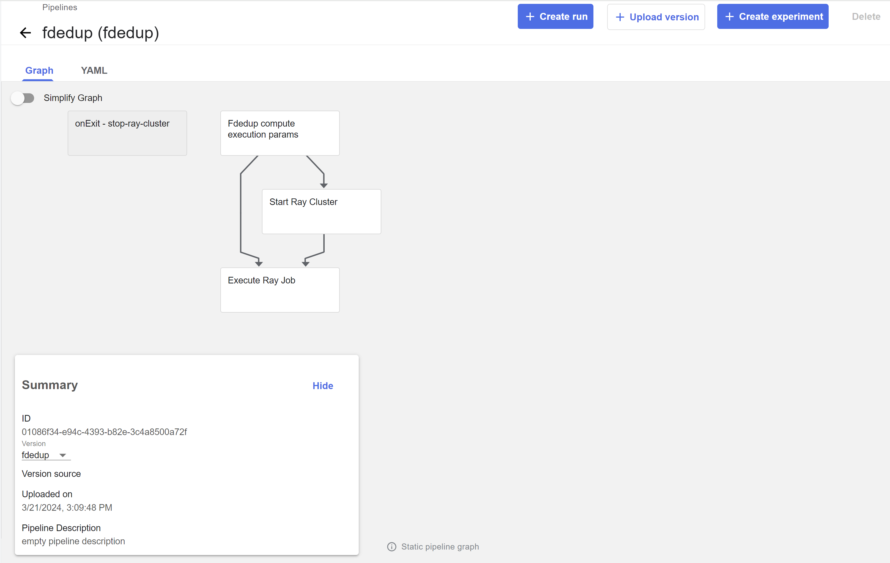

# Run several transforms

In a common scenario, users want to run a pipeline or a series of several transforms one after the other. Here we can show how to execute several transforms.

Let's assume that the input folder path is `path/to/input` and a user wants to save the output of the data after several transforms in `path/to/output`. Let's assume also that the user wants to apply the transform `A` then the transform `B` on his data.

In [Executing pipeline and watching execution results](simple_transform_pipeline.md#executing-pipeline-and-watching-execution-results) you can learn how to run a KFP pipeline of one transform. We want to use the same method to combine several transform pipelines together.

Let's start with transform A (in this example it is exat deduplication). After uploading the pipeline you can create a run from this page:

After clicking `create run` a list of input parameters is shown on the screen. In this document we want to deal with the `s3_config` input parameter. This parameter specifies the input folder path and outhput folder path. For the transform A we should have `input_folder = path/to/input` and the `output_folder=/path/to/<B>_input` which is an intermediate folder that we will use as an input for the next transform.

After completing the first transformation, we can continue to the next one. As in the previous step, we update the pipeline input parameters for the transformer `B` (in this example it is fuzzy deduplication) and create a Run.

In the list of its input parameters, we also see `s3_config`. Now, we have `input_folder = path/to/B_input` (the output folder of the previous transformation pipeline) and `output_folder=/path/to/output`, the desired output folder for the whole task. if we want to execute several transformation pipelines, we have to define more intermediate folders.

**Note** In the future, we will provide automation for this scenario when a single super pipeline combines several "simple" transformation pipelines.
