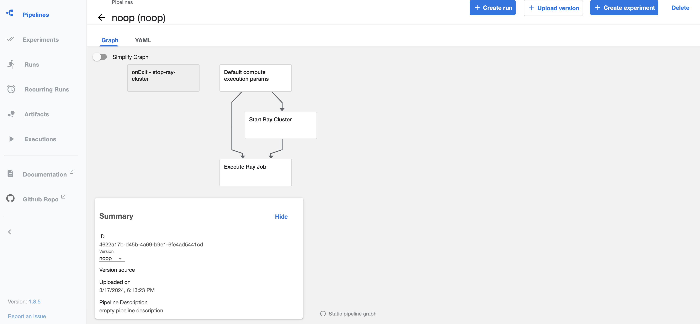

# Simplest Transform pipeline tutorial

In this example, we implement a pipeline to automate execution of the simple 
[noop transform](../../data-processing-lib/doc/simplest-transform-tutorial.md)
In this tutorial, we will show the following:

* How to write the `noop` transform automation pipeline, leveraging [KFP components](../kfp_ray_components/README.md).
* How to compile a pipeline and deploy it to KFP
* How to execute pipeline and view execution results

## Implementing pipeline

[Overall implementation](../transform_workflows/universal/noop/noop_wf.py) roughly contains 4 major sections:

* Components definition - defintion of the main steps of our pipeline
* Input parameters definition 
* Pipeline wiring - definition of the sequence of invocation (with parameter passing) of participating components
* Additional configuration

You should start by defining imports:

```python
import kfp.compiler as compiler
import kfp.components as comp
import kfp.dsl as dsl
from kfp_support.workflow_support.utils import (
    ONE_HOUR_SEC,
    ONE_WEEK_SEC,
    ComponentUtils,
)
from kubernetes import client as k8s_client
```

### Components definition

Our pipeline includes 4 steps - compute execution parameters, create Ray cluster, submit and watch Ray job, clean up 
Ray cluster. FOr each step we have to define a component that will execute them:

```python
    base_kfp_image = "us.icr.io/cil15-shared-registry/preprocessing-pipelines/kfp-data-processing:0.0.1-test3"
    # execute parameters
    compute_exec_params_op = comp.func_to_container_op(
        func=ComponentUtils.default_compute_execution_params, base_image=base_kfp_image
    )
    # create Ray cluster
    create_ray_op = comp.load_component_from_file("../../../kfp_ray_components/createRayComponent.yaml")
    # execute job
    execute_ray_jobs_op = comp.load_component_from_file("../../../kfp_ray_components/executeRayJobComponent.yaml")
    # clean up Ray
    cleanup_ray_op = comp.load_component_from_file("../../../kfp_ray_components/cleanupRayComponent.yaml")
```
Note that here we are using components described in this [document](../kfp_ray_components/README.md) for `create_ray_op`, 
`execute_ray_jobs_op` and `cleanup_ray_op`  while `compute_exec_params_op` component is build inline, because it might
differ significantly. For "simple" components we are using [defauld implementation](../kfp_support_lib/src/kfp_support/workflow_support/utils/workflow_utils.py),
while, for example for ededup, we are using a very [specialized one](../transform_workflows/universal/ededup/src/ededup_compute_execution_params.py).

### Input parameters definition

The pipeline defines all of the parameters required for the execution:

```python
    ray_name: str = "noop-kfp-ray",  # name of Ray cluster
    ray_head_options: str = '{"cpu": 1, "memory": 2, "image": "us.icr.io/cil15-shared-registry/preprocessing-pipelines/noop:guftest",\
             "image_pull_secret": "prod-all-icr-io"}',
    ray_worker_options: str = '{"replicas": 2, "max_replicas": 2, "min_replicas": 2, "cpu": 2, "memory": 4, "image_pull_secret": "prod-all-icr-io",\
            "image": "us.icr.io/cil15-shared-registry/preprocessing-pipelines/noop:guftest"}',
    server_url: str = "http://kuberay-apiserver-service.kuberay.svc.cluster.local:8888",
    additional_params: str = '{"wait_interval": 2, "wait_cluster_ready_tmout": 400, "wait_cluster_up_tmout": 300, "wait_job_ready_tmout": 400, "wait_print_tmout": 30, "http_retries": 5}',
    noop_sleep_sec: int = 10,
    lh_config: str = "None",
    max_files: int = -1,
    actor_options: str = "{'num_cpus': 0.8}",
    pipeline_id: str = "pipeline_id",
    s3_access_secret: str = "cos-access",
    s3_config: str = "{'input_folder': 'cos-optimal-llm-pile/doc_annotation_test/input/noop_small/', 'output_folder': 'cos-optimal-llm-pile/doc_annotation_test/output_noop_guf/'}",
```

**Note** that here we are specifying initial values for all parameters that will be propagated to the worklow UI
(see below)

### Pipeline wiring

Now that all components and input parameters are defined, we can implement pipeline wiring defining sequence of 
component execution and parameters submittied to every component. 

### Additional configuration

## Compiling pipeline and deploying it to KFP

To mpile pipeline execute this [file](../transform_workflows/universal/noop/noop_wf.py), which produces file `noop_wf.yaml`
in the same directory. Now create kind cluster cluster with all required software installed using the following command: 

````shell
 make setup-kind-cluster
````
**Note** that this command has to run from the project root directory

Once the cluster is up, go to `localhost:8080/kfp/`, which will bring up KFP UI, see below:


Click on the `Upload pipeline` link and follow instructions on the screen to upload your file (`noop_wf.yaml`) and
name pipeline noop. Once this is done, you should see something as follows:



## Executing pipeline and watching execution results