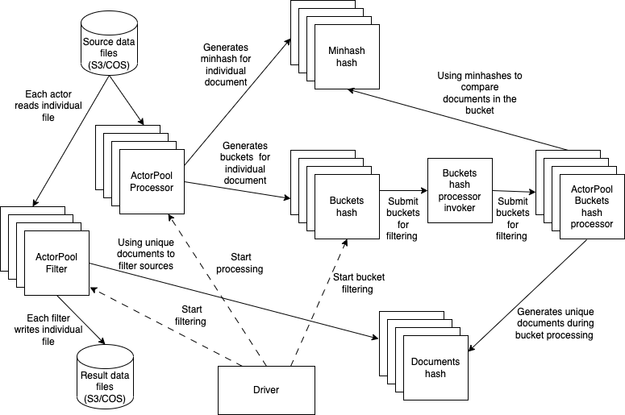

# Fuzzy Dedup

Please see the set of
[transform project conventions](../../README.md)
for details on general project conventions, transform configuration,
testing and IDE set up.

## Summary

The basic implementation of the fuzzy de dup is based on [MinHash](https://en.wikipedia.org/wiki/MinHash). Also see
[here](http://infolab.stanford.edu/~ullman/mmds/ch3n.pdf) for more details. The architecture of the implementation is presented here:



The main components of implementation are driver, processors (implemented as actor pools) - table processor, table 
filter and bucket hash processor, and hash actors - minhash, buckets and docs. 

The complication of mapping this model to transform model is the fact that in this model assumes a two pass processing, 
while a transform model is a single pass. The solution to this mismatch is to use transform runtime to implement the 
first path and use the native transform pipeline to implement filtering.

## Transform runtime
The [transform runtime](src/fdedup_transform.py) is implementing complete first path of the fuzzy de duping:
* creates bucket and minhash collectors
* implements initial file processing to populate bucket and minhash caches
* creates doc collectors 
* implement bucket processing
* Clean up everything except for doc collectors in preparation to filter, that is implemented by the framework proper
The main components of runtime are described below

### TableProcessor Actor

[Table processing actor](src/fdedup_transform.py) is implemented following framework itself is implemented as a pair -
`FdedupTransform` implementing the actual transformation and and 
[transform table processor](../../../data-processing-lib/src/data_processing/ray/transform_table_processor.py) 
(from the framework itself).

### DocsMinHash Actor

This [actor](src/fdedup_support.py) stores MInHashes

### BucketsHash Actor

This actor [actor](src/fdedup_support.py)

### BucketHashProcessor

BucketHash [actor](src/fdedup_support.py) implement the actual buckets processing, removing duplicates. 
Implementation of this actor allows to better manage this "expensive" process, by using Actor pool load balancing
thus minimizing overall time for this operation. Instead of pre partitioning buckets, it is using dynamic load
partitioning. We also are processing "longest" buckets first thus further improving performance. To further improve
the overall performance we can in future implement bucket splitting - its faster to process more smaller buckets 
then the long ones

### BucketHashProcessor

This [actor](src/fdedup_support.py) is queueing up requests to the `BucketHashProcessor` actor pool, which load 
balances their execution

### DocCollector Actor

This [actor](src/fdedup_support.py) is a collector for unique documents

## Transformer

In the fuzzy dedup implementation, the [transformer](src/fdedup_transform.py) only implements filtering. For every
table, it checks document ids with the `DocumentsCollector` cache and removes all of the rows which do not have ids in 
the hash 

## Building

A [docker file](Dockerfile) that can be used for building docker image. You can use 

```shell
make build to build it
```

### Configuration and command line Options

The set of dictionary keys holding [BlockListTransform](src/blocklist_transform.py)
configuration for values are as follows:

* _bucket_cpu_ - specifies number of CPUs for bucket actor
* _doc_cpu_ - specifies number of CPUs for doc actor
* _mhash_cpu_ - specifies number of CPUs for minhash actor
* _num_doc_actors_ - specifies number of doc actors
* _num_bucket_actors_ - specifies number of bucket actors
* _num_minhash_actors_ - specifies number of minhash actors
* _num_preprocessors_ - specifies number of preprocessors
* _num_permutations_ - specifies number of permutations
* _threshold_ - specifies threshold
* _shingles_size_ - specifies shingles size
* _japanese_data_ - specifies whether to use japanese specific document splitting
* _delimiters_ - specifies delimiter for non japanese document splitting

Above you see both parameters and their values for small runs (tens of files). We also provide an 
[estimate](src/cluster_estimator.py) to roughly determine cluster size for running transformer.

## Running

We also provide several demos of the transform usage for different data storage options, including
[local file system](src/fdedup_local.py), [s3](src/fdedup_s3.py) and [lakehouse](src/fdedup_lakehouse.py)

# Release notes